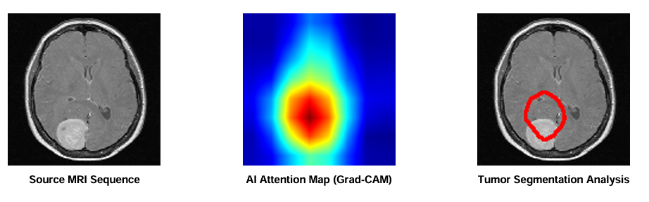

# 🧠 BrainWorks - AI-Powered Brain Tumor Detection

**BrainWorks** is a deep learning application designed to assist in the early detection and classification of brain tumors from MRI scans. Leveraging **Transfer Learning (VGG16)** and **Explainable AI (Grad-CAM)**, the system not only predicts the tumor type but also visualizes the exact region of interest that influenced the decision.

🚀 **Live Demo:** [https://brain-works-e58o.vercel.app/](https://brain-works-e58o.vercel.app/)

---

## 🎯 Key Features

* **Multi-Class Classification:** Accurately identifies four distinct conditions:
    * `Glioma`
    * `Meningioma`
    * `Pituitary Tumor`
    * `No Tumor`
* **Explainable AI (XAI):** Uses **Grad-CAM (Gradient-weighted Class Activation Mapping)** to generate heatmaps, highlighting the tumor region in red/yellow.
* **Precision Contouring:** Advanced OpenCV post-processing draws tight contours around the tumor core, filtering out noise and low-activation areas.
* **Real-time Confidence Score:** Displays the model's confidence percentage for every prediction.
* **User-Friendly Interface:** Simple web interface for easy image uploading and instant analysis.

---

## 🛠️ Tech Stack

* **Deep Learning:** TensorFlow / Keras (VGG16 Architecture)
* **Computer Vision:** OpenCV (Image processing, Contours, Heatmap generation)
* **Backend:** Python (Flask / FastAPI) *[Adjust based on your actual backend]*
* **Frontend:** HTML/CSS/JS or React *[Adjust based on your actual frontend]*
* **Deployment:** Vercel

---

## 📊 Model Architecture & Logic

The core of BrainWorks relies on a fine-tuned **VGG16** model.

1.  **Preprocessing:** Images are resized to `128x128` and normalized (`1./255`).
2.  **Prediction:** The model outputs probabilities for the 4 classes.
3.  **Grad-CAM Visualization:**
    * We extract gradients from the last convolutional layer (`block5_conv3`).
    * These gradients are pooled to create a heatmap of "attention."
    * **Post-Processing:** A high-threshold binary mask (Threshold ~190) is applied to isolate the specific tumor core, removing background noise.

---

## 📸 Screenshots

| Original Input | AI Attention Map | Final Detection |
| |
---
